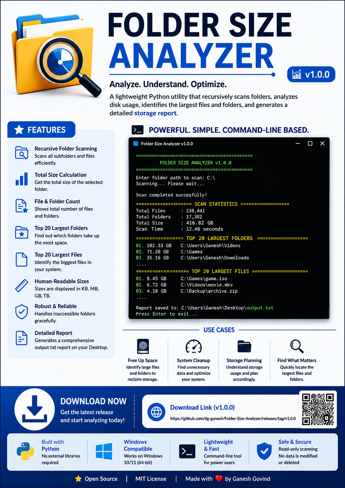

# Folder Size Analyzer

A lightweight and efficient Python utility that recursively scans folders, analyzes disk usage, identifies the largest files and folders, and generates a comprehensive storage report.


---

## Overview

**Folder Size Analyzer** is a command-line utility designed to help users quickly understand how disk space is being utilized.

The application recursively scans a selected folder, calculates the size of every subfolder, identifies the largest files and folders, and generates a detailed report for easy analysis.

The generated report is automatically saved to the **Desktop** for convenient access.

---

## Features

- 📂 Recursive folder scanning
- 📊 Calculates total folder size
- 📁 Displays Top 20 largest folders
- 📄 Displays Top 20 largest files
- 📈 Counts total files and folders
- 💾 Human-readable file sizes (KB, MB, GB, TB)
- 🛡 Gracefully handles inaccessible folders
- 📝 Automatically generates `output.txt`
- ⚡ Fast and lightweight
- 🚀 Available as a standalone Windows executable

---

## Sample Output

```
======================================================================
SCAN STATISTICS
======================================================================

Total Files   : 238,441
Total Folders : 17,382
Total Size    : 416.82 GB
Scan Time     : 12.48 seconds

======================================================================
TOP 20 LARGEST FOLDERS
======================================================================

01. 102.33 GB  D:\Games
02.  71.28 GB  D:\Movies
03.  35.16 GB  C:\Users\Ganesh

======================================================================
TOP 20 LARGEST FILES
======================================================================

01. 8.45 GB  D:\Games\game.iso
02. 6.72 GB  D:\Videos\movie.mkv
03. 4.18 GB  C:\Backup\archive.zip
```

---

## How It Works

1. Launch the application.
2. Enter the folder path to scan.
3. The application recursively scans all subfolders.
4. Folder sizes are calculated.
5. The largest folders and files are identified.
6. A detailed report is generated.
7. The report is automatically saved to your Desktop.

---

## Installation

### Option 1 – Download the Executable (Recommended)

Download the latest release from:

https://github.com/dg-ganesh/Folder-Size-Analyzer/releases

No Python installation is required.

---

### Option 2 – Run from Source

Clone the repository:

```bash
git clone https://github.com/dg-ganesh/Folder-Size-Analyzer.git
```

Navigate to the project directory:

```bash
cd Folder-Size-Analyzer
```

Run the application:

```bash
python analyzer.py
```

---

## Requirements

- Python 3.10 or later
- Windows 10 / Windows 11

No external Python libraries are required.

---

## Building the Executable

Install PyInstaller:

```bash
pip install pyinstaller
```

Build the executable:

```bash
pyinstaller --onefile --name "Folder Size Analyzer" analyzer.py
```

The executable will be available in:

```
dist/
```

---

## Project Structure

```
Folder-Size-Analyzer/
│
├── analyzer.py
├── README.md
├── LICENSE
├── .gitignore
└── requirements.txt
```

---

## Report Location

After every successful scan, the application automatically creates:

```
output.txt
```

and saves it to the current user's **Desktop**.

---

## Future Enhancements

- CSV export
- Excel export
- Progress bar
- Folder exclusion filters
- File type statistics
- Graphical User Interface (GUI)
- Multi-threaded scanning
- Search and filtering
- Scan history

---

## Releases

Latest release:

https://github.com/dg-ganesh/Folder-Size-Analyzer/releases/tag/v1.0.0

---

## Contributing

Contributions, bug reports, and feature requests are welcome.

If you have suggestions for improvements, please open an Issue or submit a Pull Request.

---

## License

This project is licensed under the MIT License.

---

## Author

**Ganesh Govind**

GitHub:
https://github.com/dg-ganesh

---

## Acknowledgements

Thank you for checking out this project.

If you find this utility useful, consider giving the repository a ⭐ on GitHub.